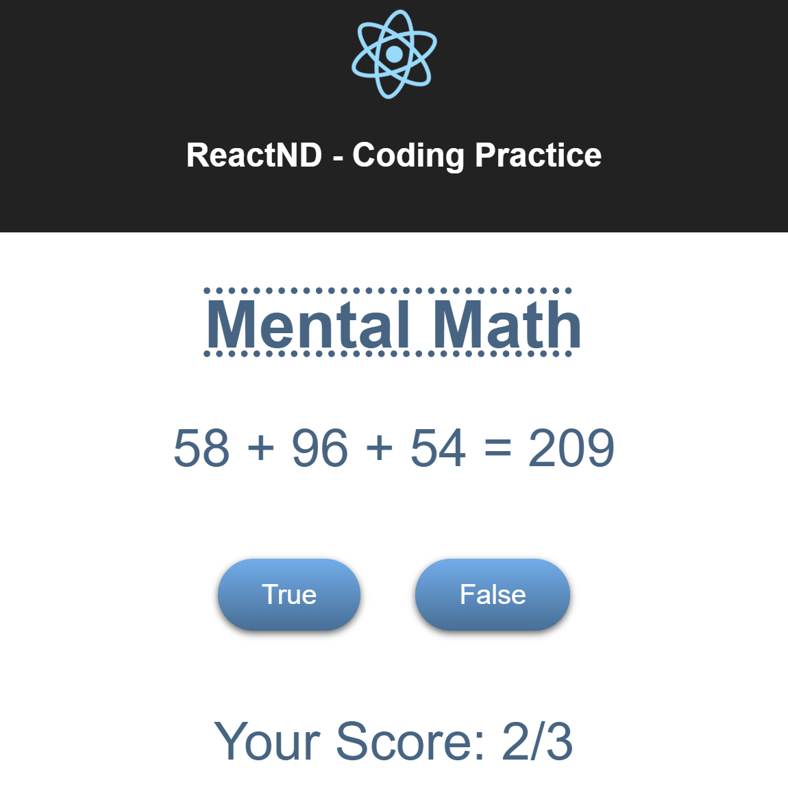

## Description

This project uses a random number generator to generate 4 numbers. The user is asked if the sum of 3 numbers is equal to the 4th number and is asked to select between true and false. 

If the user selects the correct answer, his/her score and the number of questions are incremented, else, just the number of questions are incremented.

This was done as a part of Udacity's Online React NanoDegree program. The possible solution folder contains the solution from Udacity and the src folder contains my own solution. Currently, the application uses my solution.

### Things Learnt

1. State Management in React
2. Composing application into reusable components
3. Passing data between components using props

## Instructions to Run the Project

1. Clone the repo
2. Restore dependencies using npm (Run the command npm install)
3. Start the development server by running the command npm start.
4. Navigate to the url displayed in your terminal after running npm start
