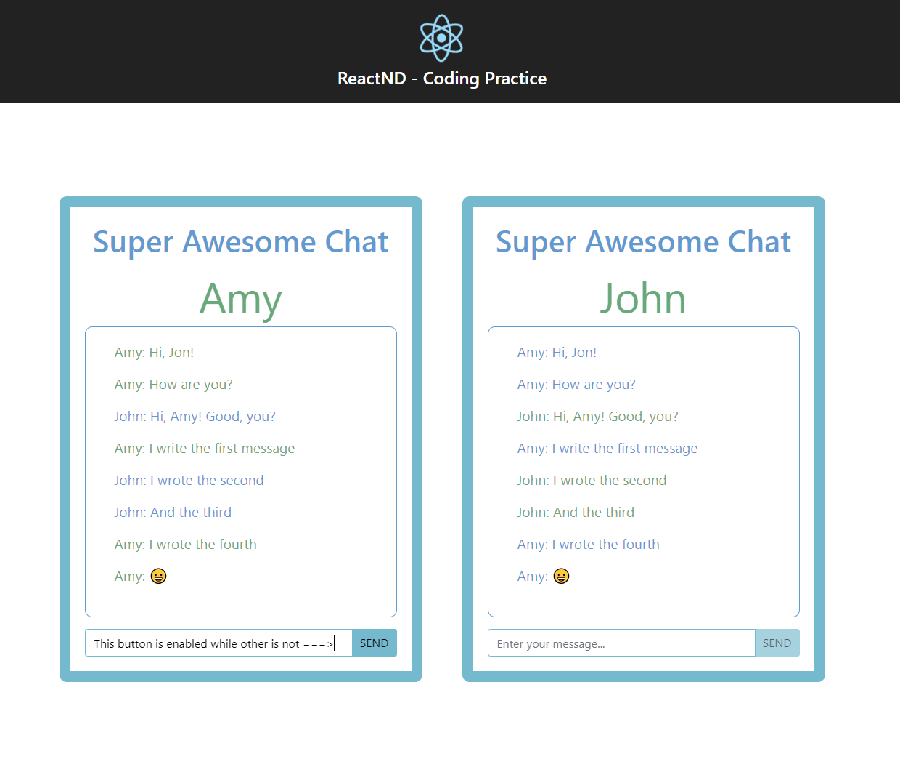

## Description

In this project, the goal was to create a simple chat application where two chat windows are displayed on the screen. Two users for the two chat windows are Amy and John. Both the users can type their chat messages and they are shown in both the windows with the name of the user who typed that message. For the lists of messages shown to both users, the messages written by the user himself/herself is shown in green and the message written by received from the other user is shown the blue. The send button gets disabled when the text box is empty and gets enabled as soon as something is entered in the text box. 

This was done as a part of Udacity's Online React NanoDegree program. The possible solution folder contains the solution from Udacity and the src folder contains my own solution. Currently, the application uses my solution.

### Things Learnt

1. State Management in React
2. Composing application into reusable components
3. Passing data between components using props
4. Controlled Components

## Instructions to Run the Project

1. Clone the repo
2. Restore dependencies using npm (Run the command npm install)
3. Start the development server by running the command npm start.
4. Navigate to the url displayed in your terminal after running npm start
