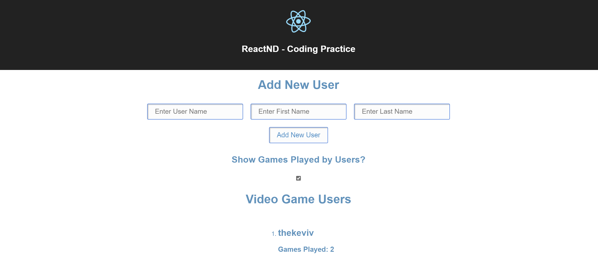

## Description

In this project, the goal was to create a simple UI which shows the users and the number of games they have played. The UI should allow adding new users and only users with unique usernames can be added. There is also a button to enable or disable showing of the number of games played by the user.

This was done as a part of Udacity's Online React NanoDegree program. The possible solution folder contains the solution from Udacity and the src folder contains my own solution. Currently, the application uses my solution.

### Things Learnt

1. State Management in React
2. Composing application into reusable components
3. Passing data between components using props

## Instructions to Run the Project

1. Clone the repo
2. Restore dependencies using npm (Run the command npm install)
3. Start the development server by running the command npm start.
4. Navigate to the url displayed in your terminal after running npm start
